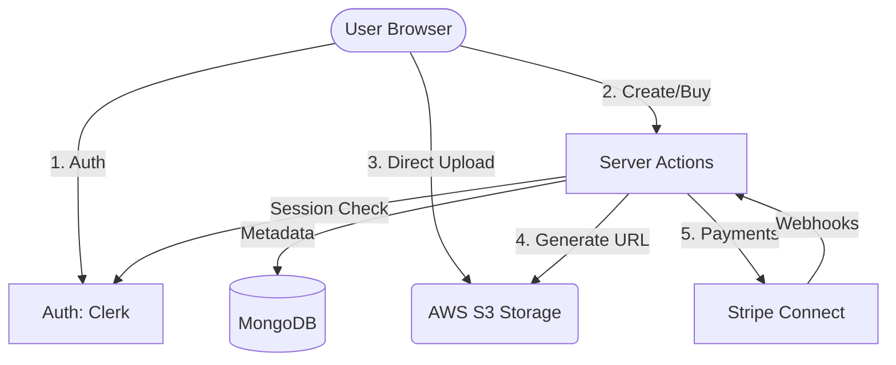

# 🔄 Application Data Flows

This document details the primary lifecycle of data within the Koda platform, from product creation to secure distribution.

---

## 1. Product Submission (Seller Workflow)

This is the core flow enabling creators to list their automations.

### 1.1 Direct File Upload (Client → AWS S3)
To optimize performance and security:
1. The user selects a JSON file and a preview image.
2. The client calls a Server Action to request **Presigned URLs** from AWS S3.
3. The server validates the user's session and generates time-limited upload links.
4. The client uploads files directly to S3 headers-first.

### 1.2 Metadata Registration (Client → Server Action → MongoDB)
Once uploads are confirmed:
1. The client invokes the `createAutomation` Server Action.
2. **Security Checks**:
    - Verifies Clerk authentication.
    - Ensures the seller has completed Stripe onboarding.
3. **Validation**: Checks inputs against Zod schemas.
4. **Persistence**: Saves the metadata (including S3 keys) to the MongoDB `Automation` collection.
5. **Cache Invalidation**: Automatically clears relevant Redis caches to show the new product immediately.

---

## 2. Stripe Connect Onboarding (Seller)

### 2.1 Account Creation
1. User accesses the "Sell" page.
2. System checks for an existing `stripeConnectId`.
3. If negative, `getStripeOnboardingLink()` creates a new **Stripe Express** account.
4. User is redirected to the Stripe-hosted onboarding form.

### 2.2 Completion and Return
1. User finishes KYC (Know Your Customer) on Stripe.
2. Stripe redirects back to `/stripe/return`.
3. The platform verifies the account status via the Stripe API.
4. If successful, `User.onboardingComplete` is set to `true` in MongoDB.

---

## 3. The Purchase Cycle (Buyer Workflow)

### 3.1 Checkout Initialization
1. Buyer clicks "Buy Now" for one or more items.
2. `createCheckoutSession()` is invoked.
3. The server validates prices and calculates the **15% Application Fee**.
4. A Stripe Checkout session is created with **Split Payment** instructions.
5. User is redirected to the secure Stripe payment page.

### 3.2 Post-Payment Processing
1. Stripe sends a `checkout.session.completed` webhook.
2. The handler verifies the signature and retrieves item metadata.
3. A `Purchase` record is created for each item in MongoDB.
4. The buyer's dashboard is updated to show the new items.

---

## 4. Secure Content Delivery (Post-Purchase)

Koda ensures that digital assets are never publicly exposed:
1. Buyer navigates to a purchased product's page.
2. The server detects a valid `Purchase` record for that user/product ID.
3. Only then, the system generates a **secure, 5-minute Presigned Download URL** from S3.
4. The user clicks "Download," and the file is fetched directly from AWS with the correct filename.

---

## 5. Architectural Overview

